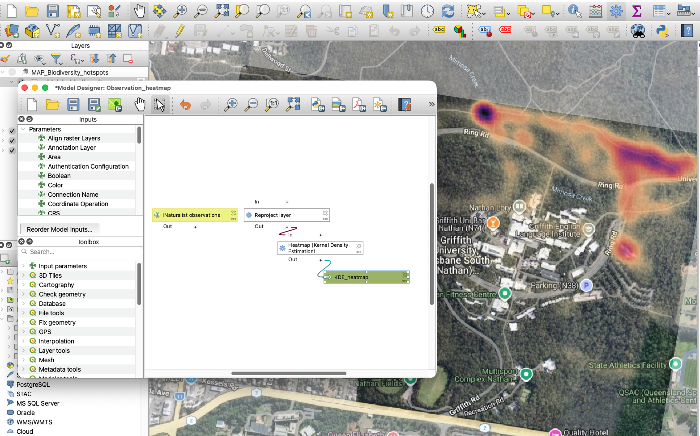

# 🌿 BioBlitz Biodiversity Spatial Analysis

## Project Overview

This project analyses biodiversity observations collected through the iNaturalist platform during Griffith University BioBlitz events. Using GIS, the project identifies spatial patterns in citizen science observations to understand where biodiversity records are concentrated and to support future biodiversity surveys and event planning.

The analysis is conducted using observations from the Griffith University Nathan Campus.

---

## Objectives

- Visualise the spatial distribution of biodiversity observations.

- Identify observation hotspots across the study area.

- Demonstrate GIS techniques for analysing citizen science datasets.

- Produce clear cartographic outputs for ecological interpretation.

---

## Study Area

**Location:** Griffith University Nathan Campus, Brisbane, Queensland, Australia

---

## Data

Biodiversity observation records were sourced from iNaturalist for the Griffith University Nathan Campus study area. The dataset consists of georeferenced citizen science observations collected during BioBlitz events.

---

## Methodology

Observation records from iNaturalist were imported into QGIS as georeferenced point data for the Griffith University Nathan Campus study area.

Kernel Density Estimation (KDE) was used to create a continuous heatmap surface showing areas of higher and lower observation density. The resulting raster was styled with a colour gradient to highlight biodiversity observation hotspots across the campus.

The KDE heatmap was then interpreted to assess spatial patterns in citizen science recording activity and support future BioBlitz survey planning.

---

## Results

The resulting KDE heatmap reveals areas where citizen scientists recorded the greatest concentration of biodiversity observations, providing an initial assessment of sampling intensity across the campus.

This map forms the foundation for future analyses, including:

- Temporal distribution of observations
- Threatened species mapping
- BioBlitz versus non-BioBlitz observations
- Participant contribution analysis

---

## Skills Demonstrated

- GIS data management
- Point-based spatial analysis
- Kernel Density Estimation (KDE)
- Raster heatmap generation
- Spatial pattern interpretation
- Heatmap visualisation
- Cartographic design
- QGIS workflow development

---

## Software

- QGIS
- iNaturalist
- Excel

## Software

- QGIS, iNaturalist, Excel
