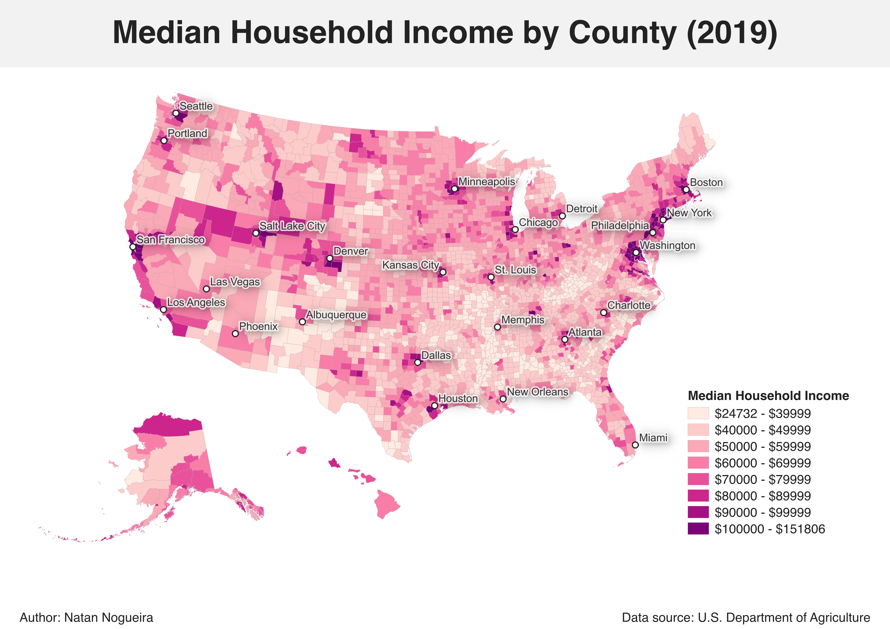

# GIS Spatial Analysis Portfolio

## 🗺️ Income Inequality Map (USA)

### Objective

Analyse spatial distribution of median household income across US cities.

### Data

- US Census Bureau (2023)

### Methods

- QGIS spatial join

- Choropleth classification (quantiles)

- Attribute filtering

### Key Findings

- Clear spatial clustering of high-income areas in coastal cities
