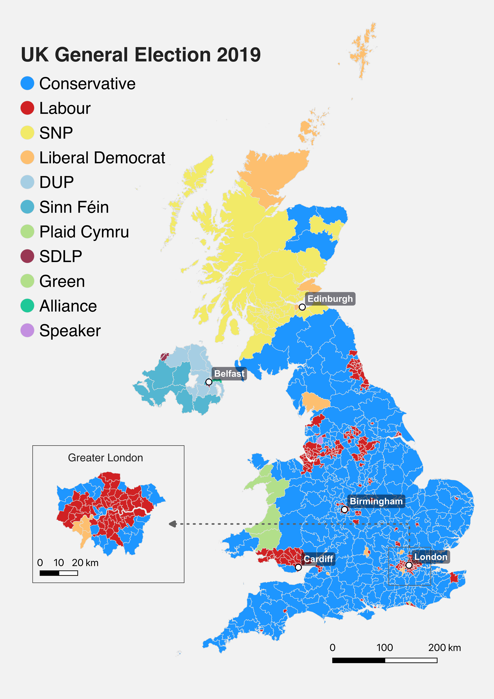

# Election Map - Constituencies won by parties

### Objective

Process geospatial data to illustrate parliamentary seats won in the UK's general election 2019 per party per constituency. 

### Data

### Methods

Symbology categorization:
- Classify geospatial data by Political Party with most seats won.

Attribute filtering: 
- Performed an attribute join between county-level income data (xls) and county boundary polygons (gpkg) using common geographic identifiers.

Data classification: 
- Choropleth classification (natural breaks), separated by US$ 10,000 increments (excluding first and last tiers). 

Print layout:
- Addition of two inset maps in addition to continental U.S. to improve visibility of the states of Hawaii and Alaska.
- Alteration of Coordinate Reference Systems (CRS) for the additional two maps to improve projection (EPSG: 3338 / ESRI: 102007)

### Key Findings

- Clear spatial clustering of high-income areas in coastal cities
- Lower-income counties were more prevalent in parts of the Southeast and interior regions.
- MAUP (Modifiable Areal Unit Problem) is a limitation. Economic data is susceptible to discrepancies depending on definition of county boundaries.
