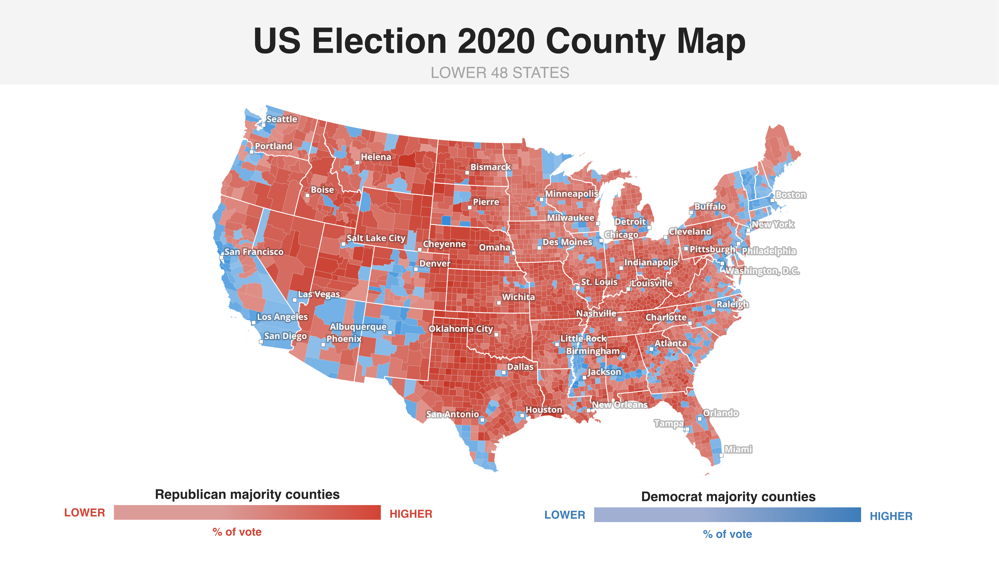

# US Election Results by County (2020)

### Objective

Visualise UK Parliamentary constituency-level results from the 2019 General Election, showing the winning party in each constituency.

### Data
Office for National Statistics (ONS, 2019)

### Methods

Data classification: 
- Applied categorical symbology to classify constituencies by winning political party
- Created a filtered duplicate layer for the Greater London region
- Ranked parties based on constituency win counts

Print layout:
- Added inset map to highlight Greater London at higher resolution
- Included map overview frame for spatial context
- Used callout annotations to link main map to inset focus area
  
### Key Findings

- The Conservative Party shows widespread constituency dominance across England and parts of Wales, while the SNP dominates constituencies in Scotland, reflecting strong regional political clustering.
- Labour support is more geographically concentrated in urban areas, but less spatially dominant overall compared to Conservative and SNP strongholds.
- Limitation: the map shows only winning party per constituency and does not represent vote share or margin of victory, limiting deeper interpretation of electoral strength.
  

